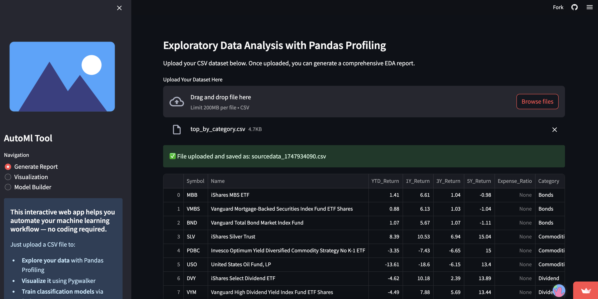

# AutoML Tool

This Streamlit app simplifies your ML workflow by combining automated EDA with Pandas Profiling, interactive visualizations through Pygwalker, and AutoML-based classification modeling using PyCaret - all in one place.



## Installation

1. Clone the repository.

2. Install the required packages by running the following command:

   ```bash
   pip install -r requirements.txt
   ```
   **Note:** It is recommended to create a virtual environment before installing the dependencies.

3. Run the application by executing the following command:

   ```bash
   streamlit run app.py
   ```

4. The application will open in your default browser.

## Usage

- Upload your CSV dataset in the "Generate Report" section.
- Use the sidebar navigation to switch between different functionalities:
    - **Generate Report**: Upload your dataset and generate an automated Exploratory Data Analysis (EDA) report using `ydata-profiling` (formerly Pandas Profiling).
    - **Visualization**: Interactively explore and visualize your uploaded data using Pygwalker.
    - **Model Builder**: Automatically train and compare multiple classification models using PyCaret and download the best one.

### Generate Report:

- Click on the **Generate Report** option in the sidebar.
- Upload your dataset (CSV format) using the file uploader. The uploaded data will be displayed.
- Click the **Generate Profile Report** button.
- A progress indicator will show the status while the automated EDA report is generated using `ydata-profiling`.
- The comprehensive report will be displayed within the app once completed.

### Visualization:

- Select the **Visualization** option in the sidebar.
- If a dataset has been uploaded, an interactive Pygwalker interface will appear, allowing you to create various visualizations by dragging and dropping fields.
- The visualization interface utilizes the full page width for a better experience.

### Model Builder:

- Select the **Model Builder** option in the sidebar.
- If a dataset has been uploaded, you can perform automated machine learning for classification tasks using PyCaret.
- Select the target variable (the column you want to predict) from the dropdown menu.
- Click the **Train Models** button. PyCaret will automatically:
    - Preprocess the data.
    - Train several common classification algorithms (Logistic Regression, Random Forest, Gradient Boosting, etc.).
    - Compare the models based on standard metrics.
    - Select the best-performing model.
- The results and the name of the best model (`.pkl` file) will be displayed.
- A **Download Best Model** button will become active, allowing you to save the trained model file locally.

**Note:** Make sure to replace `"logo.png"` with your own logo file in the `app.py` code if desired.

## Deployment

This project can be deployed using Streamlit, a powerful Python library for building interactive web applications. Follow the steps below to deploy the project on a server or cloud platform.

To find more information about deploying an app, click [here](https://docs.streamlit.io/streamlit-community-cloud/get-started/deploy-an-app).


## Contributing

Contributions are welcome! If you find any issues or have suggestions, please feel free to open an issue or submit a pull request.

